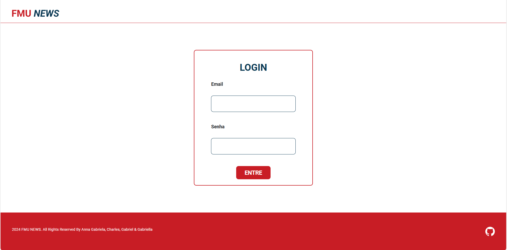
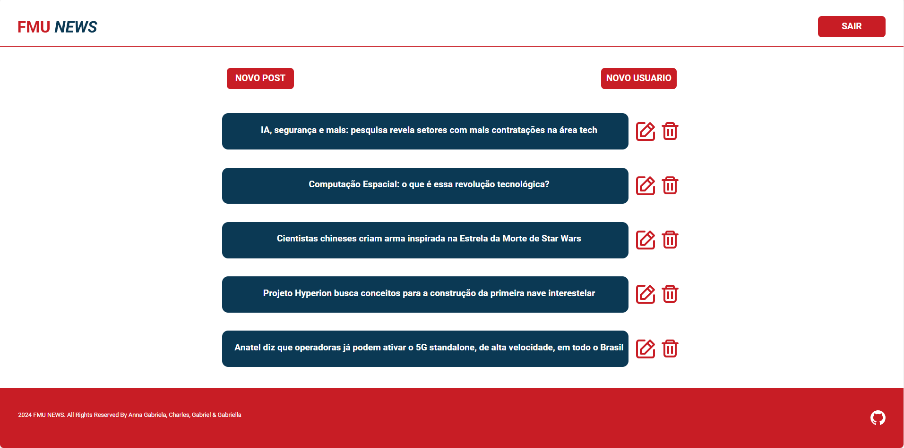
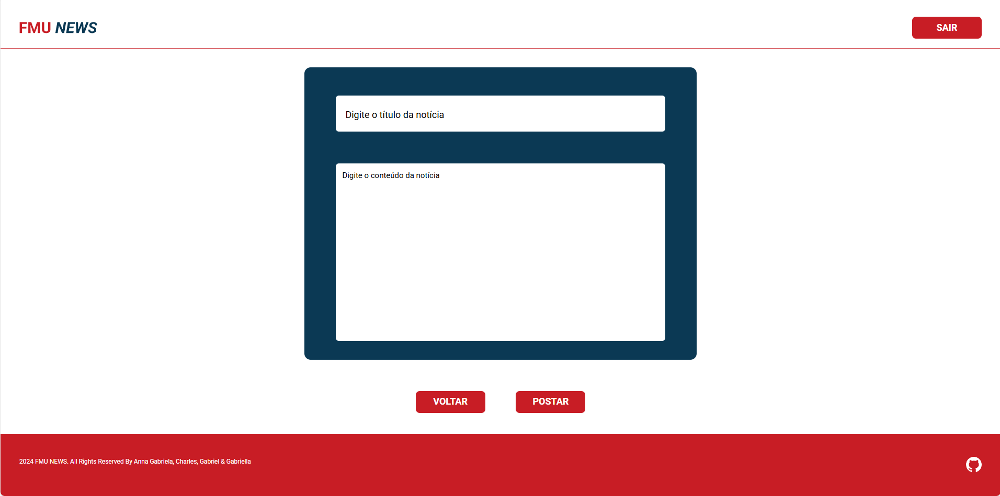
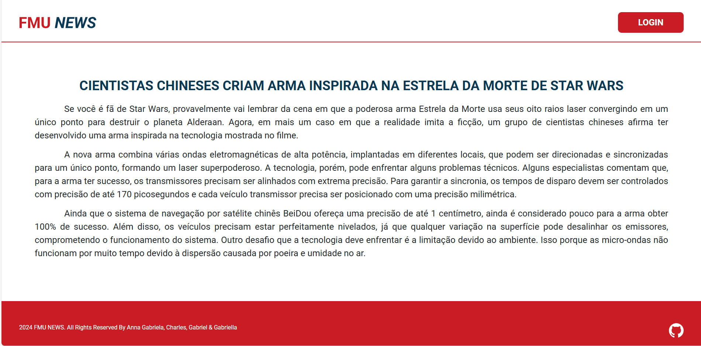

## FMU NEWS

## Descrição do Projeto
O FMU News é um site de notícias desenvolvido como projeto para a disciplina Desenvolvimento de Interface Web, com o objetivo de criar uma plataforma informativa.

## Funcionalidades:

- **Página inicial:** Apresenta as últimas notícias em destaque, categorias e um breve sobre o site.
- **Seção de notícias:** Contém artigos completos com título e conteúdo detalhado.
- **Sistema de login:** Permite que usuários cadastrados acessem áreas restritas do site
- **Painel administrativo:** Permite a criação, edição e exclusão de notícias, categorias e usuários

## Tecnologias Utilizadas

**Front-End**


**Back-End**


**Banco de Dados**


**Hospedagem**


## Imagens das Partes Principais do Projeto Funcionado
**Página Principal**


**Página de Login**


**Página com Todas as Noticias**


**Página Para Criar ou Editar as Noticias**


**Página de Noticia**


## Acesse Nosso Projeto
[](https://www.figma.com/design/5CflBYbkceLWuCDT8vWlgp/Design-de-Interface-Web?node-id=1-3&node-type=frame&t=qD52a5vwpm7f4nf0-0) [](https://fmu-news.vercel.app/login.html)


## Instruções de Instalação
**Clone o repositório:**
```bash
git clone https://github.com/annaagabi/fmu-news.git
```

Use o código com cuidado.

### Como Contribuir
- **Forkar o repositório:** Crie uma cópia do repositório em sua conta.
- **Criar um branch:** Crie um novo branch para suas alterações.
- **Fazer as alterações:** Edite os arquivos e adicione suas novas funcionalidades.
- **Commitar as alterações:** Faça commit das suas alterações.
- **Enviar um pull request:** Envie um pull request para o repositório original.

## Autores
- [@annaagabi](https://www.github.com/annaagabi)
- [@charlesjrr](https://www.github.com/charlesjrr)
- [@GakPss](https://www.github.com/GakPss)
- [@Gabizinhadias010](https://www.github.com/Gabizinhadias010)